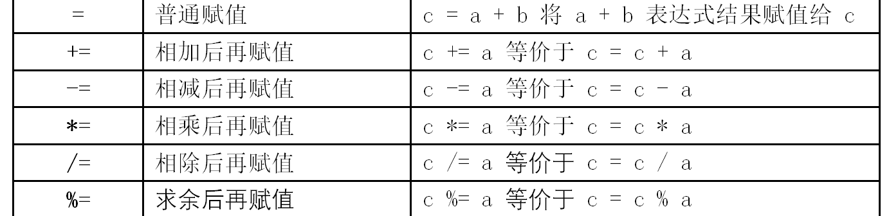

<!-- TOC -->

- [golang 学习](#golang-学习)
- [前言](#前言)
    - [1.1 为什么有golang</br>](#11-为什么有golangbr)
    - [1.2 应用方向 </br>](#12-应用方向-br)
    - [1.3 谁发明了Golang</br>](#13-谁发明了golangbr)
    - [1.4 发展史</br>](#14-发展史br)
    - [1.5 语言特点</br>](#15-语言特点br)
    - [1.6 开发工具</br>](#16-开发工具br)
    - [1.7 开发环境配置</br>](#17-开发环境配置br)
        - [1.7.1. 安装SDk](#171-安装sdk)
        - [1.7.2. 环境变量](#172-环境变量)
        - [1.7.3. 环境变量配置：](#173-环境变量配置)
    - [1.8 编译执行流程</br>](#18-编译执行流程br)
    - [1.9 go开发注意事项</br>](#19-go开发注意事项br)
    - [1.10 转义符</br>](#110-转义符br)
    - [1.11 代码风格</br>](#111-代码风格br)
    - [1.12 标识符命名规范</br>](#112-标识符命名规范br)
        - [1.12.1. 概念</br>](#1121-概念br)
        - [1.12.2. 命名规则</br>](#1122-命名规则br)
        - [1.12.3. 命名注意事项</br>](#1123-命名注意事项br)
        - [1.12.4. 系统保留关键字和预定义标识符</br>](#1124-系统保留关键字和预定义标识符br)
    - [1.13 编程指南和API</br>](#113-编程指南和apibr)
- [第二章 变量和基本数据类型</br>](#第二章-变量和基本数据类型br)
    - [2.1 变量</br>](#21-变量br)
        - [2.1.1. 变量的概念](#211-变量的概念)
        - [2.1.2. 变量的使用](#212-变量的使用)
    - [2.2 基本数据类型</br>](#22-基本数据类型br)
        - [2.2.1. 数值型](#221-数值型)
        - [2.2.2.布尔型](#222布尔型)
        - [2.2.3.字符型](#223字符型)
        - [2.2.4.字符串</br>](#224字符串br)
        - [2.2.5. 基本数据类型的相互转换</br>](#225-基本数据类型的相互转换br)
- [第三章 运算符](#第三章-运算符)
    - [3.1 算术运算符](#31-算术运算符)
        - [3.1.1 算术运算符注意事项</br>](#311-算术运算符注意事项br)
    - [3.2 赋值运算符](#32-赋值运算符)
    - [3.3 比较运算符/关系运算符](#33-比较运算符关系运算符)
    - [3.4 逻辑运算符](#34-逻辑运算符)
    - [3.5 位运算符](#35-位运算符)
    - [3.6 其它运算符](#36-其它运算符)
    - [3.7 运算符优先级](#37-运算符优先级)
- [第四章 流程控制](#第四章-流程控制)
    - [4.1 顺序结构 </br>](#41-顺序结构-br)
    - [4.2 选择结构</br>](#42-选择结构br)
    - [4.3 循环结构</br>](#43-循环结构br)
- [第五章 复杂或者派生数据类型](#第五章-复杂或者派生数据类型)
    - [5.1 函数](#51-函数)
        - [5.1.1 函数声明和使用](#511-函数声明和使用)
        - [5.1.2 函数类型和作用域](#512-函数类型和作用域)
        - [5.1.3 匿名函数和闭包](#513-匿名函数和闭包)
        - [5.1.4 init函数](#514-init函数)
    - [5.2 数组](#52-数组)
    - [5.3 切片](#53-切片)
    - [5.4 map](#54-map)
    - [5.5 结构体](#55-结构体)
    - [5.6 指针</br>](#56-指针br)
    - [5.7 接口](#57-接口)
    - [5.8 管道](#58-管道)
- [第六章 面相对象 </br>](#第六章-面相对象-br)
    - [6.1 匿名组合</br>](#61-匿名组合br)
    - [6.2 方法</br>](#62-方法br)
    - [6.3 方法继承和重写</br>](#63-方法继承和重写br)
    - [6.4 方法值和方法表达式</br>](#64-方法值和方法表达式br)
- [第七章 异常处理</br>](#第七章-异常处理br)
    - [error接口</br>](#error接口br)
    - [panic函数</br>](#panic函数br)
    - [defer延迟调用</br>](#defer延迟调用br)
    - [recover</br>](#recoverbr)
- [第八章 文件操作</br>](#第八章-文件操作br)
- [第九章 工程管理</br>](#第九章-工程管理br)
    - [同级目录](#同级目录)
    - [不同级目录，包](#不同级目录包)

<!-- /TOC -->
# golang 学习


# 前言


## 1.1 为什么有golang</br>


1、计算机硬件技术更新频繁，性能提高快，目前主流编程语言发展落后于硬件，不能发挥多核多CPU的优势</br>
2、软件系统复杂度越来越高，维护成本也越高，缺乏一个简洁高效的编程语言；主流语言风格不统一、计算能力不够、处理大并发不够好</br>
3、主流的C/C++项目运行速度快，但是编译速度慢并且还存在内存泄漏的困扰。

## 1.2 应用方向 </br>

-   区块链工程师</br>
-   GO服务器端/游戏软件工程师</br>
-   Golang分布式/云计算软件工程师</br>


## 1.3 谁发明了Golang</br>

-   Ken Thompson (肯.汤普森) ： C语言的发明人、Unix的原创者</br>
-   Rob Pike（罗布.派克）：贝尔实验室的Unix团队、UTF-8创造者</br>
-   Robert Griesemer ：java HotSpot的编译器开发、Chrome浏览器的js引擎V8的开发

## 1.4 发展史</br>

-   2007 年，谷歌工程师 Rob Pike, Ken Thompson 和 Robert Griesemer
    开始设计一门全新的语言，这是语言的最初原型
-   2009 年 11 月 10 日，Google 将 Go 语言以开放源代码的方式向全球发
-   2015 年 8 月 19 日，Go 1.5 版发布，本次更新中移除了"最后残余的 C
    代码"
-   2017 年 2 月 17 日，Go 语言 Go 1.8 版发布
-   2017 年 8 月 24 日，Go 语言 Go 1.9 版发布。 1.9.2 版本
-   2018 年 2 月 16 日，Go 语言 Go 1.10 版发布。

## 1.5 语言特点</br>

Go
语言保证了既能到达静态编译语言的安全和性能，又达到了动态语言开发维护的高效率，使用一个表达式来形容
Go 语言：Go = C + Python , 说明 Go 语言既有 C
静态语言程序的运行速度，又能达到 Python 动态语言的快速开发。

-   从 C
    语言中继承了很多理念，包括表达式语法，控制结构，基础数据类型，调用参数传值，指针等等，也保留了和
    C 语言一样的编译执行方式及弱化的指针
-   引入包的概念，用于组织程序结构，Go
    语言的一个文件都要归属于一个包，而不能单独存在。</br>
-   垃圾回收机制，内存自动回收，不需开发人员管理.</br>
-   天然并发 (重要特点)：
    -   从语言层面支持并发，实现简单；</br>
    -   goroutine，轻量级线程，可实现大并发处理，高效利用多核；</br>
    -   基于 CSP 并发模型(Communicating Sequential Processes )实现.</br>
-   吸收了管道通信机制，形成 Go 语言特有的管道 channel 通过管道 channel,
    可以实现不同的 goroute之间的相互通信。</br>
-   函数可以返回多个值。</br>
-   新的创新：比如切片 slice、延时执行 defer.

## 1.6 开发工具</br>

-   VSCode：Visual Studio Code Microsoft
-   Golang
-   Subline Text
-   Vim
-   Eclipse IDE
-   Lite IDE</br>
    初学建议：先选择用 visual studio code 或者 vim
    文本编辑器本，方便对Go
    语言的语法有更好的了解之后再使用Golang、Eclipse 等 IDE 开发工具。

## 1.7 开发环境配置</br>

### 1.7.1. 安装SDk

-   手动下载： 去官网 <https://golang.org> 或者
    <https://www.golangtc.com/download>
    下载，下载后解压，放到软件安装目录，目录路径不能有空格。
-   命令行安装：brew或者yum

<!-- -->
    brew install go

### 1.7.2. 环境变量

-   GOROOT：SDk安装路径</br>
-   Path：SDK中的bin目录</br>
-   GOPATH：开发人员工作目录

### 1.7.3. 环境变量配置：

-   Windows：计算机---\>属性---\>高级设置：新增GOROOT、GOPATH，修改Path，末尾追加：;%GOROOT%\bin                   
-   linux/MAC：/etc/profile或者\~/.bash\_profile
    添加GOROOT、Path、GOPATH

<!-- -->
    export GOROOT=安装路径                  
    export PATH=$PATH:$GOROOT/bin
    export GOPATH=工作路径


## 1.8 编译执行流程</br>

   ***Go build-\>run和go run两种执行流程的方式区别***

-   如果我们先编译生成了可执行文件，那么我们可以将该可执行文件拷贝到没有
    go 开发环境的机器上，仍然可以运行</br>
-   如果我们是直接 go run
    go源代码，那么如果要在另外一个机器上这么运行，也需要go开发环境，否则无法执行。</br>
-   在编译时，编译器会将程序运行依赖的库文件包含在可执行文件中，所以，可执行文件变大了很多。

## 1.9 go开发注意事项</br>


-   Go 源文件以 "go" 为扩展名。</br>
-   Go 应用程序的执行入口是 main()函数。 这个是和其它编程语言（比如
    java/c）一样</br>
-   Go 语言严格区分大小写。</br>
-   Go 方法由一条条语句构成，每个语句后不需要分号(Go
    语言会在每行后自动加分号)，这也体现出 Golang 的简洁性。</br>
-   Go
    编译器是一行行进行编译的，因此我们一行就写一条语句，不能把多条语句写在同一个，否则报错</br>
-   go 语言定义的变量或者 import 的包如果没有使用到，代码不能编译通过。</br>
-   大括号都是成对出现的，缺一不可。

## 1.10 转义符</br>


        \a             匹配响铃符    （相当于 \x07 注意：正则表达式中不能使用 \b 匹配退格符，因为 \b 被用来匹配单词边界，可以使用 \x08 表示退格符。
        \f             匹配换页符    （相当于 \x0C）
        \t             匹配横向制表符（相当于 \x09）
        \n             匹配换行符    （相当于 \x0A）
        \r             匹配回车符    （相当于 \x0D）
        \v             匹配纵向制表符（相当于 \x0B）
        \123           匹配 8  进制编码所代表的字符（必须是 3 位数字）
        \x7F           匹配 16 进制编码所代表的字符（必须是 3 位数字）
        \x{10FFFF}     匹配 16 进制编码所代表的字符（最大值 10FFFF  ）
        \Q...\E        匹配 \Q 和 \E 之间的文本，忽略文本中的正则语法

        \\             匹配字符 \
        \^             匹配字符 ^
        \$             匹配字符 $
        \.             匹配字符 .
        \*             匹配字符 *
        \+             匹配字符 +
        \?             匹配字符 ?
        \{             匹配字符 {
        \}             匹配字符 }
        \(             匹配字符 (
        \)             匹配字符 )
        \[             匹配字符 [
        \]             匹配字符 ]
        \|             匹配字符 |

## 1.11 代码风格</br>


-   Go 官方推荐使用行注释来注释整个方法和语句。
-   使用一次 tab 操作，实现缩进,默认整体向右边移动，时候用 shift+tab
    整体向左移
-   使用 gofmt 来进行格式
-   运算符两边习惯性各加一个空格。比如：2 + 4 \* 5。
-   一行最长不超过 80 个字符，超过的请使用换行展示，尽量保持格式优雅
	- 换行的时候用+连接，+必须放到上一行

## 1.12 标识符命名规范</br>


### 1.12.1. 概念</br>
可以自己起名字的各种变量、方法、函数等命名时使用的字符序列称为标识符</br>
### 1.12.2. 命名规则</br>
-	由 26 个英文字母大小写，0-9  ，_  组成 </br>
-	数字不可以开头。 </br>
-	Golang 中严格区分大小写。</br>
-	标识符不能包含空格。</br>
- 	下划线"_"本身在 Go 中是一个特殊的标识符，称为空标识符。可以代表任何其它的标识符，但是它对应的值会被忽略(比如：忽略某个返回值)。所以仅能被作为占位符使用，不能作为标识符使用</br>
-	不能以系统保留关键字作为标识符（一共有 25 个），比如 break，if 等等.</br>

### 1.12.3. 命名注意事项</br>
-	***包名***：保持 package 的名字和目录保持一致，尽量采取有意义的包名，简短，有意义，不要和标准库不要冲突 如：fmt</br>
- 	变量名、函数名、常量名：采用驼峰法举</br>
-	如果变量名、函数名、常量名首字母大写，则可以被其他的包访问；如果首字母小写，则只能在本包中使用 ( 注：可以简单的理解成，首字母大写是公开的，首字母小写是私有的) ,在 golang 没有public , private 等关键字。</br>

### 1.12.4. 系统保留关键字和预定义标识符</br>


## 1.13 编程指南和API</br>


-   官方编程指南：<https://golang.org> ---\>Tour</br>
-   官方标准库 API 文档， <https://golang.org/pkg></br>
-   中文API： <https://studygolang.com/pkgdoc>

# 第二章 变量和基本数据类型</br>

## 2.1 变量</br>


变量是程序的基本组成单位

### 2.1.1. 变量的概念

变量相当于内存中一个数据存储空间的表示，你可以把变量看做是一个房间的门牌号，通过门牌号我们可以找到房间，同样的道理，通过变量名可以访问到变量

### 2.1.2. 变量的使用

   ***使用步骤***

-   声明变量(也叫:定义变量) var 变量 数据类型</br>
-   变量赋值</br>
-   使用变量

   ***Golang 变量使用的三种方式***

-   第一种：指定变量类型，声明后若不赋值，使用默认值：`var a int`</br>
-   第二种：根据值自行判定变量类型(类型推导)： `var b := 100`</br>
-   第三种：省略 var, 注意
    :=左侧的变量不应该是已经声明过的，否则会导致编译错误：`b := 100`

    ***多变量声明***

`a, b, c := 100, 200, “test”`

    
***全局多变量***

    var (
        a = 100
        b = 200
        c = “test”
    )

***注意事项***

-   变量的值可以在同一类型范围内不断变化</br>
-   变量在同一个作用域(在一个函数或者在代码块)内不能重名
-   Golang 的变量如果没有赋初值，编译器会使用默认值, 比如 int 默认值 0
    string 默认值为空串， 小数默认为 0

***程序中 +号的使用***

-   当左右两边都是数值型时，则做加法运算</br>
-   当左右两边都是字符串，则做字符串拼接

## 2.2 基本数据类型</br>


基本数据类型包含数值型、布尔型、字符串，没有专门的字符型，字符型用数值型byte保存单个字符

### 2.2.1. 数值型

包含整数类型（int，int8，int16，int32，int64，uint，uint8，uint16，uint32，uint64，byte）和浮点数类型（float32，float64）

***整型***

    int8    占用：1字节      表示范围：-128~127
    int16   占用：2字节      表示范围：-2^15~2^15   -1
    int32   占用：4字节      表示范围：-2^31~2^31   -1
    int64   占用：8字节      表示范围：-2^63~2^63   -1

    uint8   占用：1字节      表示范围：0~255
    uint16  占用：2字节      表示范围：0~2^16   -1
    uint32  占用：4字节      表示范围：0~2^32   -1
    uint64  占用：8字节      表示范围：0~2^64   -1

    int    占用：4/8(32/64位系统  )    表示范围：等价int32/int64
    uint    占用：4/8(32/64位系统 )    表示范围：等价uint32/uint64
    rune    占用：等价int32           表示范围：-2^31~2^31   -1
    byte    占用：等价uint8           表示范围：0~255

***浮点型***

    float32 占用：4字节      表示范围：-3.403E38~3.403E38
    float64 占用：8字节      表示范围：-1.798E308~1.798E308

***对浮点型的说明***:

-   关于浮点数在机器中存放形式的简单说明,浮点数=符号位+指数位+尾数位，说明：浮点数都是有符号的.</br>
-   尾数部分可能丢失，造成精度损失。 -123.0000901
    -   说明：float64 的精度比 float32 的要准确.</br>
    -   说明：如果我们要保存一个精度高的数，则应该选用 float64</br>
-   浮点型的存储分为三部分：符号位+指数位+尾数位，在存储过程中，精度会有丢失</br>
-   float32 小数最多保留7位，末位数字会+1，float64 小数位最多保留15位</br>
-   float32 会在末位进一，使用%f输出，会默认保留6位</br>

***使用细节***</br>

**整数型**：

-   Golang 各整数类型分：有符号和无符号，int uint 的大小和系统有关。
-   Golang 的整型默认声明为 int 型
-   如何在程序查看某个变量的字节大小和数据类型 ：unsafe.sizeof()
-   Golang
    程序中整型变量在使用时，遵守保小不保大的原则，即：在保证程序正确运行下，尽量使用占用空间小的数据类型。【如：年龄】
-   bit:
    计算机中的最小存储单位。byte:计算机中基本存储单元。\[二进制再详细说\]
    1byte = 8 bit

**浮点型**：

-   Golang 浮点类型有固定的范围和字段长度，不受具体 OS(操作系统)的影响。
-   Golang 的浮点型默认声明为 float64 类型。

***浮点型常量有两种表示形式：***

-   十进制数形式：如：5.12 .512 (必须有小数点）</br>
-   科学计数法形式:如：5.1234e2= 5.12</br>
-   10 的 2 次方，5.12E-2 = 5.12/10 的 2 次方

通常情况下，应该使用 float64 ，因为它比 float32
更精确。
\[开发中，推荐使用 float64\]


### 2.2.2.布尔型

bool 占用：1字节 表示范围：true和false bool
类型适于逻辑运算，一般用于程序流程控制

### 2.2.3.字符型 

-   字符类型：go语言***英文字母1 个字节，汉字3 个字节***,其他语言两个字节
-   如果我们保存的字符在 ASCII 表的,比如\[0-1, a-z,A-Z..\]直接可以保存到
    byte
-   如果我们保存的字符对应码值大于 255,这时我们可以考虑使用 int 类型保存
    如果我们需要安装字符的方式输出，这时我们需要格式化输出，即`fmt.Printf(“%c”, c1)`

***使用细节***</br>

-   字符常量是用单引号('')括起来的单个字符。例如：`var c1 byte = 'a' var    c2 int = '中' var c3 byte = '9'`</br>
-   Go
    中使用转义符将其后的字符转变为特殊字符型常量。例如：`var c3 byte = '\n'， '\n'表示换行符`</br>
-   Go 语 言 的 字 符 使 用 UTF-8 编 码 ， 如 果 想 查 询 字 符 对
    应的utf8 码
    值[http://www.mytju.com/classcode/tools/encode\\\_utf8.asp](http://www.mytju.com/classcode/tools/encode_utf8.asp)</br>
-   英文字母-1 个字节 汉字-3 个字节</br>
-   在 Go 中，字符的本质是一个整数，直接输出时，是该字符对应的 UTF-8
    编码的码值。</br>
-   可以直接给某个变量赋一个数字，然后按格式化输出时%c，会输出该数字对应的unicode
    字符</br>
-   字符类型是可以进行运算的，相当于一个整数，因为它都对应有 Unicode 码.

***字符类型本质***：

-   字符型 存储到 计算机中，需要将字符对应的码值（整数）找出来存储：字符
    ---\> 对应码值------\>二进制--\>存储；读取：二进制----\> 码值
    ----\>字符 --\> 读取</br>
-   字符和码值的对应关系是通过字符编码表决定的(是规定好)</br>
-   Go语言的编码都统一成utf-8。非常的方便，很统一，再也没有编码乱码的困扰了

### 2.2.4.字符串</br>

***基本介绍***</br>

字符串就是一串固定长度的字符连接起来的字符序列。Go
的字符串是由单个字节连接起来的。Go 语言的字符串的字节使用 UTF-8 编码标识
Unicode 文本

***string 使用注意事项和细节***</br>

-   Go 语言的字符串的字节使用 UTF-8 编码标识 Unicode 文本，这样
    Golang统一使用 UTF-8 编码,中文乱码问题不会再困扰程序员。</br>
-   字符串一旦赋值了，字符串就不能修改了：在 Go
    中字符串是不可变的。</br>
-   字符串的两种表示形式：双引号, 会识别转义字符；\`
    反引号，以字符串的原生形式输出，包括换行和特殊字符，可以实现防止攻击、输出源代码等效果</br>
-   字符串拼接方式:当一行字符串太长时，需要使用到多行字符串，可以如下处理

### 2.2.5. 基本数据类型的相互转换</br>

***基本数据类型默认值***：

     int                        0
     float32/float64            0
     字符串                      “”
     bool                      false

***数据类型转换基本介绍***：

Golang 和 java / c 不同，Go
在不同类型的变量之间赋值时需要显式转换。也就是说 Golang
中数据类型不能自动转换。 表达式 T(v) 将值 v 转换为类型 T T:
就是数据类型，比如 int32，int64，float32 等等 v: 就是需要转换的变量

***转换注意事项***：

-   Go 中，数据类型的转换可以是从 表示范围小--\>表示范围大，也可以
    范围大---\>范围小，大范围到小范围会造成不精确或者溢出</br>
-   被转换的是变量存储的数据(即值)，变量本身的数据类型并没有变化！</br>
-   在转换中，比如将 int64 转成 int8
    【-128---127】，编译时不会报错，只是转换的结果是按溢出处理，和我们希望的结果不一样。</br>
    因此在转换时，需要考虑范围.

***数值型---\>string***：

1、fmt.Sprintf("%参数", 表达式)

2、strconv 包的函数

    func FormatBool(b bool) string                          

    func FormatInt(i int64, base int) string;base 必须在2到36之间，结果中会使用小写字母’a'到'z'表示大于10的数字

    func FormatUint(i uint64, base int) string

    func FormatFloat(f float64, fmt byte, prec, bitSize int) string;bitSize表示f的来源类型（32：float32、64：float64），会据此进行舍入。fmt表示格式：'f'（-ddd.dddd）、'b'（-ddddp±ddd，指数为二进制）、'e'（-d.dddde±dd，十进制指数）、'E'（-d.ddddE±dd，十进制指数）、'g'（指数很大时用'e'格式，否则'f'格式）、'G'（指数很大时用'E'格式，否则'f'格式）。prec控制精度（排除指数部分）：对'f'、'e'、'E'，它表示小数点后的数字个数；对'g'、'G'，它控制总的数字个数。如果prec 为-1，则代表使用最少数量的、但又必需的数字来表示f。

    func Itoa(i int) string

***string---\>数值型***：

    func ParseBool(str string) (value bool, err error)；返回字符串表示的bool值。它接受1、0、t、f、T、F、true、false、True、False、TRUE、FALSE；否则返回错误。
    func ParseInt(s string, base int, bitSize int) (i int64, err error)返回字符串表示的整数值，接受正负号。base指定进制（2到36），如果base为0，则会从字符串前置判断，"0x"是16进制，"0"是8进制，否则是10进制；bitSize指定结果必须能无溢出赋值的整数类型，0、8、16、32、64 分别代表 int、int8、int16、int32、int64；返回的err是*NumErr类型的，如果语法有误，err.Error = ErrSyntax；如果结果超出类型范围err.Error = ErrRange。
    func ParseUint(s string, base int, bitSize int) (n uint64, err error)；ParseUint类似ParseInt但不接受正负号，用于无符号整型。
    func ParseFloat(s string, bitSize int) (f float64, err error)；解析一个表示浮点数的字符串并返回其值。如果s合乎语法规则，函数会返回最为接近s表示值的一个浮点数（使用IEEE754规范舍入）。bitSize指定了期望的接收类型，32是float32（返回值可以不改变精确值的赋值给float32），64是float64；返回值err是*NumErr类型的，语法有误的，err.Error=ErrSyntax；结果超出表示范围的，返回值f为±Inf，err.Error= ErrRange。

***string 转基本数据类型的注意事项***

-   在将 String 类型转成 基本数据类型时，要确保 String
    类型能够转成有效的数据，比如 我们可以把 "123" ,
    转成一个整数，但是不能把 "hello" 转成一个整数，如果这样做，Golang
    直接将其转成 0 ， 其它类型也是一样的道理. float =\> 0 bool =\> false

-	string 转 byte   []byte(string)
-	含中文的string转字符   []rune(string) 会转成字母和单个汉字的切片
-	byte 转 string   string([]byte)

# 第三章 运算符

运算符是一种特殊的符号，用以表示数据的运算、赋值和比较等运算符是一种特殊的符号，用以表示数据的运算、赋值和比较等</br>

**常见运算符**：
-   算术运算符
-   赋值运算符
-   比较运算符/关系运算符
-   逻辑运算符
-   位运算符
-   其它运算符

## 3.1 算术运算符

算术运算符是对数值类型的变量进行运算的，比如：加减乘除。</br>
**算术运算符表**


### 3.1.1 算术运算符注意事项</br>

-   对于除号 "/"，它的整数除和小数除是有区别的：整数之间做除法时，只保留整数部分而舍弃小数部分。  例如：  x := 19/5 ,结果是	3 </br>
-   当对一个数取模时，可以等价 a%b=a-a/b*b  ， 这样我们可以看到 取模的一个本质运算。</br>
-   Golang 的自增自减只能当做一个独立语言使用时，不能这样使用</br>
```
var i int = 100
	var b = i++

  ++    --  只能作为单独一行使用  
```
-   Golang 的++ 和 -- 只能写在变量的后面，不能写在变量的前面，即：只有 a++ a-- 没有 ++a   ，--a</br>
-   Golang 的设计者去掉 c / java 中的 自增自减的容易混淆的写法，让 Golang 更加简洁，统一。(强制性的)</br>


## 3.2 赋值运算符




## 3.3 比较运算符/关系运算符


## 3.4 逻辑运算符

   


（逻辑与）&& 优先级  大于  ||（逻辑或）

-	&& （短路与）之前条件为假，后条件不执行直接返回假
-	|| （短路或）之前条件为真，后条件不执行直接返回真


## 3.5 位运算符


## 3.6 其它运算符


-	go语言明确不支持三元运算符

## 3.7 运算符优先级


# 第四章 流程控制

## 4.1 顺序结构 </br>

***顺序结构***：程序按顺序执行，不发生跳转。

```
a := 1
b := 2
c := a + b
```

## 4.2 选择结构</br>

***选择结构***：依据是否满足条件，有选择的执行相应功能。

```
a := 1
b := 2
var c int
if a > b {
    c = a - b
}else{
   c =  b - a 
}
```

 ```
 switch 变量或者表达式的值{
	case 值1:
		要执行的代码
	case 值2:
		要执行的代码
	case 值3:
		要执行的代码
	………………………………..
	default:
		要执行的代码
}
 ```

-	go 条件判断允许声明变量
```
if a:= 20 ; a >18 {
}
```
-	fallthrough 可以执行相邻的下面的case，不会break出来

-	case 后可以多个表达式

-	switch后可以定义变量
```
switch a := 20{
	case a>10:
	....
}
```
-	type-switch 可以判断空接口指向的类型

```
var i interface{}
var x = 1
switch i := x.(type){
	case nil :
	case string:
	...
}
```

## 4.3 循环结构</br>

***循环结构***：依据条件是否满足，循环多次执行某段代码

```
//
for i := 0 ;i<10 ; i++  {
    
}
//相当于while
for{

}
//相当于for each
for i,v := range arr{

}
```

-	for 初始化;条件;迭代表达式{代码体} 
-	for 循环条件 {代码体}  初始化和迭代表达式写入其他位置
-	for{代码体}类似while 需要在代码体中写入条件和break
-	for-range遍历，所有能用len()来找到长度的都可以使用,针对string的***汉字***，需要特殊处理先转换成字符切片 


-	break 默认是跳出最近的for循环
	-	break 结合label 可以调出label所在的循环
	```
	label:
	for {
		for {
			break label //调出最外层for循环
		}
	}
	```
-	continue 跳过本次循环
	-	continue 结合label，跳过最近的for，进入外层，迭代的条件，类似break
	```
	label:
	for {
		for {
			continue label //此用法相当于break出本层循环
		}
	}
	```

# 第五章 复杂或者派生数据类型

复杂和派生数据类型包含：指针pointer、数组、map、结构体struct、管道channel、函数、接口interface、切片slice</br>


## 5.1 函数

### 5.1.1 函数声明和使用

   ``` 
    func 函数名(参数) 返回值 {

    }
   ```
***函数名***遵循标识符命名规范，同一个包中函数名唯一，函数名的地址表示 函数在 内存的代码区的地址
***参数/形参***可以有多重表示方式：
-   ```a int ,b int``` 普通参数，定义0个或者多个，定义完，调用时必须都传值，</br>
-   ```a , b int```   普通参数，定义0个或者多个，定义完，调用时必须都传值，</br>
-   ```a ... int```   不定参数，根据需要可以传0~n个</br>
-   ```b int ,a ... int```   普通参数和不定参数混合，不定参数要放在后面</br>
***返回值***可以是一个或者多个

***使用实例***

```
func Func() {
	//func funcName (int,int)int{}   //func 函数名 （参数） 返回值可选 {}

	//声明、定义、使用
	sum, sub := funcName1(11, 19)
	fmt.Println(sum, sub)

	sum1, sub1 := funcName2(11, 19)
	fmt.Println(sum1, sub1)

	funcName3()
	funcName3(1, 2)
	funcName3(1, 2, 3, 4)

    funcTest(1, 2, 3, 4, 5)

    var f1 = funcTest
	f1(1, 2, 3, 4)
}
func funcTest(args... int){
    funcName3(args[:]...)
}
func funcName1(a int, b int) (sum int, sub int) { //固定参数和返回值
	sum = a + b
	sub = a - b
	return
}
func funcName2(a, b int) (int, int) { //固定参数和返回值
	sum := a + b
	sub := a - b
	return sum, sub
}
func funcName3(args ...int) { //不定参数可以传0~n个参数
	for i := 0; i < len(args); i++ {
		fmt.Println(args[i])
	}
}
func Func3(args ...float64) (sum float64, avg float64) {
	for i := 0; i < len(args); i++ {
		sum += args[i]
	}
	avg = sum / float64(len(args))
	return //方法一
	// return sum , avg  //方法二

}
//方法三
func Func2(args ...float64) (float64, float64) {
	var sum, avg float64
	for i := 0; i < len(args); i++ {
		sum += args[i]
	}
	avg = sum / float64(len(args))
	return sum, avg
}
```

### 5.1.2 函数类型和作用域

***函数类型***：可以像基础数据类型一样声明</br>

```
func funcName3(args ...int) { //不定参数可以传0~n个参数
	for i := 0; i < len(args); i++ {
		fmt.Println(args[i])
	}
}
//var f1 = funcName3
//f1 := funcName3
f1(1, 2, 3, 4)
```

```
type DoubleArgReturnSFunc func(int, int) (int, int)

func funcName1(a int, b int) (sum int, sub int) { //固定参数和返回值
	sum = a + b
	sub = a - b
	return
}
//var addSub func(int, int) (int, int) //方法一
var addSub DoubleArgReturnSFunc //方法二
addSub = funcName1
sum3, sub3 := addSub(11, 19)
fmt.Println(sum3, sub3)
```
***全局变量*** </br>
-   遵循标识符命名规则
-   同一个包中，全局变量不能重名
-   定义在函数之外
-   可以和局部变量重名，遵循就近原则，如果函数中有局部变量和全部变量重名，优先响应之前最近的变量
-   全局变量存储在数据区，未赋值存储在数据区的未初始化数据区，赋值过，存储在初始化数据区


### 5.1.3 匿名函数和闭包

***匿名函数*** 没有方法名的函数

```
func (){

}
```
匿名函数的调用

```
var f = func() {
   fmt.Println("匿名函数")
}
f()
或者
func(){
    fmt.Println("匿名函数") 
}()
直接调用
```
***闭包*** 在go语言中匿名函数就是闭包

```
func funcBlock() func() int {
	var x int
	f := func() int {
		x++
		return x
	}
	return f
}
f := funcBlock()
fmt.Println(f())
fmt.Println(f())
fmt.Println(f())
fmt.Println(f())
fmt.Printf("%T,%T,%T", funcBlock, f, f())
//输出
1
2
3
4
func() func() int,func() int,int
```

### 5.1.4 init函数

-	如果一个文件包含全局变量、init、main，执行顺序：全局变量初始化-->init()---->main()
-	init函数负责初始化工作
-	如果init()在包中，那么在引入包的时候，就先执行包中的init(),例如：main包中引入了util包，则先执行util包中的uitl中的init(),后执行main中的全局变量、init()和main()

## 5.2 数组

数组是一系列相同数据类型在内存中有序存储的数据集合

var 数组名 [元素个数]数据类型

```
//var array [4]int = [4]int{0,1,2,3}
//var array [4]int = [4]int{0,1}  //局部赋值，其他值默认为0
//var array [4]int = [4]int{1:2}  //指定赋值
//var array [4]int = [...]int{1:2} 
//array := [4]int{}//类型推导
//下标赋值,
//array[0]=1
```
-   数组下标从 0开始到len（array）-1结束
-   数组取地址需要加 & ，地址指向第一个元素的地址
-   数组生命时的数组长度不能为变量，只能为字面常量或者const 常量


***二维数组*** 
```
var array [4][2]int = [4][2]int{{0,1,2,3},{1,2,3}}
```
-   和一维数组类似，在声明的时候和赋值的时候，需要用二维下标来定位元素位置
-   取值时默认一维取出来的是行对应的一维数组

## 5.3 切片

var 切片名 []数据类型

```
//定义
//var slice []int = []int{0,1,2,3}
//var slice []int = []int{0,1}  //局部赋值，其他值默认为0
//var slice []int = []int{1:2}  //指定赋值
//下标赋值,空切片为nil，指向0x0，不能直接用下标赋值
//slice[0]=1//error
//slice := []int{}//类型推导
//slice := make([]int,10)//make(类型，长度，容量可选)
//slice=append(slice,1,2)//append(切片，内容不定参列表（1~n)
var slice []int = []int{1, 2, 3, 4, 5}
s := make([]int, 5)
copy(s,slice) //copy 之后会存在两份，修改不影响原始切片
fmt.Println(s)
```
-   在使用appned进行数据添加时  如果长度超出容量  容量会自动扩容，一般扩容方式为上一次 容量*2  如果超过1024字节 每次扩容上一次的1/4，容量扩容每次都是偶数
-   len(slice)  计算切片的长度
-   cap(slice)  计算切片的容量
-   append如果没有超过容量，地址不发生改变，如果超过容量，切片地址会发生变化
-   切片取地址 不需要加& 直接%P，指向第一个元素的地址，切片截取会影响原来切片的值
-   切片作为函数参数传递时，是引用传递（地址传递），函数中修改切片的属性，如果容量没超过原始切片容量(使用append超过容量后地址会发生变化)原始切片会一起发生变化，如果超过原始切片容量，则原始数据不发生变化


## 5.4 map

定义 var 变量名 map[keytype]valuetype  :

```
//map 需要初始化后才能赋值，只声明是一个空指针指向0x0
//定义 var 变量名 map[keytype]valuetype  :
// keytype可以用= /！=比较的都可以作为key,float,切片，函数不能作为keytype
//var dic map[int]string = map[int]string{101: "wo", 102: "ta"}
//dic := map[int]string{101: "ta", 102: "wo"}
dic := make(map[int]string)
dic[101] = "wo"
dic[102] = "ta"
fmt.Println(dic)
//map 需要初始化后才能赋值，只声明是一个空指针指向0x0
//var dic map[int]string
//dic[101] = "wo"
delete(dic, 101)
fmt.Println(dic)
```
-   map是引用传递（地址传递），作为函数参数时，函数中map发生变化，原始数据也会发生变化 
-	map删除delete不存在的key不会报错
-	可以用 value，ok=m[key]来判断是否存在一个key  

## 5.5 结构体

定义：type 结构体名 struct{
        成员名 类型
     }

```
type student struct {
	stid    int
	name    string
	age     int
	address string
}
func structTest(stu student) {
	stu.age = 19
}
func structTestMap(m map[string]student) {
	temp := m["tom"]
	temp.age = 20
	m["tom"] = temp
	////结构体作为map的value不能直接用 map[keyType].出来
	////m["tom"].age = 20//error  cannot assign to struct field m["tom"].age in map
	//
	//fmt.Println(m)
}
//调用
//var stu student = student{101, "jack", 28, "北京市昌平区"}
	//stu := student{102, "her", 18, ""}
	//var stu student
	//stu.name = "jack"

	//stuSlice := []student{student{101, "jack", 18, "beijing"}, student{102, "her", 18, "changping"}}
	//
	//fmt.Println(stuSlice)

	//结构体作为map的value
	//m := make(map[string]student)
	//m["jack"] = student{1001, "jack", 19, "beijing"}
	//m["tom"] = student{1002, "tom", 18, "beijing"}
	//fmt.Println(m)
	//delete(m, "jack")
	//fmt.Println(m)
	//

	////结构体切片作为map的value
	//sliceM := make(map[string][]student)
	//sliceM["1001"] = []student{student{1001, "jack", 19, "beijing"}, student{1002, "tom", 18, "beijing"}}
	//sliceM["1002"] = []student{student{1001, "jack", 19, "beijing"}, student{1002, "tom", 18, "beijing"}}
	//
	//fmt.Println(sliceM)
	//
	//sliceM["1002"][1].name = "her"
	//fmt.Println(sliceM)
	//
	//sliceM["1002"] = append(sliceM["1002"], student{1003, "test", 100, "beijing"})
	//fmt.Println(sliceM)

	//结构体作为函数参数
	stu := student{1001, "jack", 18, "beijing"}
	structTest(stu)
	fmt.Println(stu)

	//结构体map作为函数参数
	m := map[string]student{"tom": student{1001, "jack", 18, "beijing"}}
	structTestMap(m)
	fmt.Println(m)
//输出
{1001 jack 18 beijing}
map[tom:{1001 jack 20 beijing}]
```

-   结构体作为map的value不能直接用 map[keyType].出来

-	结构体tag，来解决转json首字母大写问题
```
type student struct {
	Stid    int 'json:"stid"'
	Name    string 'json:"name"'
	Age     int 'json:"age"'
	Address string 'json:"address"'
}
```

## 5.6 指针</br>

***基本介绍***：

-   基本数据类型，变量存的就是值，也叫值类型</br>
-   获取变量的地址，用&，比如：`var num int`, 获取 num 的地址：`&num`</br>
-   指针类型，指针变量存的是一个地址，这个地址指向的空间存的才是值比如：
    `var ptr *int = &num.`</br>
-    获取指针类型所指向的值，使用：*，比如：var ptr *int,  使用*ptr 获取 ptr 指向的值</br>


```
type student struct {
	stid int
	name string
	age  int
}
func main(){
  //指针声明和使用
	//a := 123
	//var p *int = &a

	//var p *int = new(int)
	//*p = 1234
	//fmt.Printf("%T,%p,%v", p, p, *p)

	//数组指针int
	//var arr *[10]int = &[10]int{1, 2, 3, 4, 5, 6}
	//fmt.Printf("%p,%v,%v", arr, *arr, (*arr)[0])

	//指针类型要和接收的指针类型保持一致
	//var p *[10]int
	//arr2 := [10]int{1, 2, 3, 4, 5, 6, 7, 8, 9, 10}
	//p = &arr2
	//fmt.Printf("%T,%p,%T,%p", p, p, arr2, &arr2)

	//指针数组
	//a := 1
	//b := 2
	//var arr [10]*int = [10]*int{&a, &b}
	////arr[0] = &a
	////arr[1] = &b
	//fmt.Printf("%p,%v,%v", &arr, arr, *arr[0])

	////指针变量作为函数参数
	//a, b := 10, 20
	//swap(&a, &b)
	//
	//fmt.Println(a, b)
	//
	////数组指针变量作为函数参数
	//arr := [10]int{10, 9, 8, 7, 6, 5, 4, 3, 2, 1}
	//bubbleSort(&arr)
	//fmt.Println(arr)

	//指针数组
	//a, b, c := 10, 20, 30
	//arr := [10]*int{&a, &b, &c}
	//fmt.Println(arr)
	//
	//d := [2]int{1, 2}
	//e := [2]int{1, 2}
	//f := [2]int{1, 2}
	//arr2 := [3]*[2]int{&d, &e, &f}
	//fmt.Println(arr2)
	//
	//for _, v := range arr2 {
	//	fmt.Println(*v)
	//}

	//指针和切片
	//slice := []int{9, 3, 42, 1, 43, 4, 5, 546}
	//fmt.Println(slice)
	//p := &slice
	//fmt.Printf("%T,%p,%T,%p\n", p, p, slice, slice)
	////fmt.Println(p[1])//error 指向切片的指针无法根据下标取出对应元素
	//fmt.Println((*p)[1])
	//sliceSort(p)
	//fmt.Println(*p)

	////指针和结构体
	//结构体指针
	//var stu *student = &student{101, "jack", 19, "changping"}
	//fmt.Printf("%p,%v", stu, *stu)
	//stu := student{1001, "jack", 18}
	//structTest(&stu)
	//fmt.Println(stu)

	//结构体数组指针
	//arr := [3]student{student{1001, "jack", 18}, student{1001, "jack", 18}}
	//fmt.Println(arr)
	//p := &arr
	//fmt.Println(*p)
	//p[0].name = "test" //ok
	////(*p)[0].name = "jjj"  //ok
	//fmt.Println(p[0])

	//多级指针
	a := 10

	p := &a

	pp := &p

	ppp := &pp

	fmt.Printf("%p,%T\n", ppp, ppp) //0xc42008a020,***int
	fmt.Printf("%T\n", ***ppp)      //int
	fmt.Printf("%T\n", **pp)        //int
	fmt.Printf("%T\n", *p)          //int
}
func swap(a, b *int) {
	*a, *b = *b, *a
}
func bubbleSort(arr *[10]int) {
	for i := 0; i < len(arr)-1; i++ {
		for j := 0; j < len(arr)-1-i; j++ {
			////常规取值方式
			//if (*arr)[j] > (*arr)[j+1] {
			//	(*arr)[j], (*arr)[j+1] = (*arr)[j+1], (*arr)[j]
			//}
			////或者 ------数组指针可以直接操作数组元素
			if arr[j] > arr[j+1] {
				arr[j], arr[j+1] = arr[j+1], arr[j]
			}
		}
	}
}
func sliceSort(slice *[]int) {
	//切片使用append函数时，当切面容量发生变化，会改变切片的地址
	*slice = append(*slice, 111, 222, 333, 444)
}
func structTest(stu *student) {
	//结构体变量名，可以简易省略*
	stu.age = 110
	//(*stu).age = 120
}

*int,地址=0xc420084008,1234
```

***指针使用注意事项***</br>
-	值类型，都有对应的指针类型，  形式为 *数据类型，比如 int 的对应的指针就是 *int,float32对应的指针类型就是	*float32, 依次类推。</br>
-	值类型包括：基本数据类型 int 系列, float 系列, bool, string 、数组和结构体 struct	</br>

        
***值类型和引用类型***   </br>       
 
***值类型***：基本数据类型 int 系列, float  系列, bool, string 、**数组**和 **结构体struct**     </br> 

***引用类型***：指针、slice 切片、map、管道 chan、interface 等都是引用类型	 </br> 

***值类型和引用类型的使用特点*** </br>      

-	***值类型***：变量直接存储值，内存**通常**在栈中 </br>
-	***引用类型***：变量存储的是一个地址，这个地址对应的空间才真正存储数据(值)，内存**通常**在堆上分配，当没有任何变量引用这个地址时，该地址对应的数据空间就成为一个垃圾，由 GC 来回收</br>
-  ***逃逸分析***：go在一定程度消除了堆和栈的区别，因为go在编译的时候进行逃逸分析，来决定一个对象放栈上还是放堆上，不逃逸的对象放栈上，可能逃逸的放堆上。</br>
	- 最大的好处应该是减少gc的压力，不逃逸的对象分配在栈上，当函数返回时就回收了资源，不需要gc标记清除。</br>
	- 因为逃逸分析完后可以确定哪些变量可以分配在栈上，栈的分配比堆快，性能好</br>
	- 同步消除，如果你定义的对象的方法上有同步锁，但在运行时，却只有一个线程在访问，此时逃逸分析后的机器码，会去掉同步锁运行。</br>


## 5.7 接口

接口是一种规范与标准，不关心具体的实现过程

***接口定义和使用***

```
type peopleer interface{
	
}
```
-   type 接口名 interface{} 来定义一个接口
-   接口名一般以er结尾
-   接口只定义方法，不实现方法


```
type student struct {
	stid    int
	name    string
	age     int
	address string
}
type peopler interface {
	run()
}
type teacherLeader struct {
	student
	level int
}

func (stu student) run() {
	fmt.Printf("%s 跑步\n", stu.name)
}
func (tea teacherLeader) run() {
	fmt.Printf("%s 开车\n", tea.name)
}
func runAction(i peopler) {
	i.run()
}
func Interface() {
	stu := student{1001, "jack", 18, "beijing"}
	//stu.run()
	teaLeader := teacherLeader{student{1001, "jack", 18, "beijing"}, 10}
	//teaLeader.run()

	runAction(stu)
	runAction(teaLeader)
}
//log
jack 跑步
jack 开车
```
-   定义接口，实现接口，通过函数传递接口来实现多态

***接口继承和转换***

```
type peopler interface {
	run()
}
type teacherleaderer interface {
	peopler
	test()
}
type teacherLeader struct {
	//student
	level int
}

func (tea teacherLeader) run() {
	fmt.Printf("%d 开车\n", tea.level)
}
func (tl teacherLeader) test() {
	fmt.Printf("%d 测试\n", tl.level)
}
	var p peopler
	var stuer teacherleaderer = teacherLeader{1}
	//接口继承
	stuer.run()
	stuer.test()

	//父接口接收 子接口
	p = stuer
	p.run()
//输出
1 开车
1 测试
1 开车
```
-   接口可以通过继承来使用父接口的方法
-   父接口可以接收子接口的对象

***空接口***

```
type nilInterfacer interface {
}
    var test1 nilInterfacer = 1
	var test2 nilInterfacer = "test"
	fmt.Println(test1, test2)
//输出
1 test
```
-   空接口可以接收任意类型的参数

***类型断言***

```
//类型断言
	var test1 nilInterfacer = 1
	var test2 nilInterfacer = "test"
	fmt.Println(test1, test2)

	var arr [2]nilInterfacer = [2]nilInterfacer{test2, test1}
	for _, v := range arr {
		if value, ok := v.(string); ok == true {
			fmt.Println("string", value)
		} else if value, ok := v.(int); ok == true {
			fmt.Println("int", value)
		} else {
			fmt.Println("other")
		}
	}
//输出
1 test
string test
int 1
```

-   可以通过 变量.(类型来判断) 来判断是否是某类型


## 5.8 管道


# 第六章 面相对象 </br>

***面向过程***就是：强调的是步骤、过程、每一步都是自己亲自去实现的
***面向对象***：其实就是找一个专门做这个事的人来做，不用关心具体怎么实现的，面相对象有两个概念是比较重要的，一是对象，二是类

-   严格意义上，GO语言中没有类(class)的概念,但是在go中可以将结构体比作为类，因为在结构体中可以添加属性（成员），方法（函数）
-   严格意义上，GO语言中是没有继承的，但是我们可以通过”匿名组合”来实现继承的效果：在一些类（结构体）中，写一些重复的成员，我们可以将这些重复的成员，单独的封装到一个类(结构体)中，作为这些类的父类(结构体)

## 6.1 匿名组合</br>

所谓匿名组合其实就是结构体嵌套，省略了变量名</br>
也可以使用带变量名的方法，使用结构体嵌套，但是在使用的时候也需要指定变量名才能赋值

```
type people struct {
	name string
	age  int
}
type student struct{
    //匿名字段
    people 
	//p people //使用的时候需要  xxx.p.name =XXX
    stid   int
    class  int
    //重名字段 遵循就近原则
    name   string 
}
type teacher struct{
    *people
    tid   int
    class int
}
type teacherLeader struct{
    teacher
    lid    int
    leavel int
} 
//初始化
var stu student = student{people{"jack", 18}, 101, 2, "test"}
fmt.Println(stu)
//匿名字段遵循就近原则，如果子类中有，父类中值未发生变化
stu.name = "her"
fmt.Println(stu)
//stu.name = "test"
fmt.Println(stu, stu.people.name)
//匿名指针,遵循指针的规则，需要先定义后使用
var tea teacher
tea.people = new(people)
//tea.people.name = "jack"
tea.name ="jack"
//tea := teacher{&people{"jack", 18}, 111, 102}
fmt.Println(*tea.people, tea)
```

//输出</br>
{{jack 18} 101 2 test}</br>
{{jack 18} 101 2 her}</br>
{{jack 18} 101 2 her} jack</br>
{jack 0} {0xc420098020 0 0}</br>
{jack 0}</br>


-	匿名字段属性和当前结构体属性重名，遵循就近原则，如果子结构体没有，默认使用父结构体的字段，如果子结构体有，则使用子结构体中字段
-	匿名结构体指针，遵循指针规则，需要在使用前先new（结构体）
-	匿名结构体指针可以直接.name 出来属性，可以省略（*xxx.people）
-	匿名结构体指针可以成功更改对应的结构体的值


## 6.2 方法</br>

```
func (tea teacherLeader) printfMsg() {
	fmt.Printf("name=%s,age=%d,tid=%d,class=%d,lid=%d,leavel=%d\n", tea.teacher.people.name, tea.age, tea.tid, tea.class, tea.lid, tea.leavel)
}
func (tea teacherLeader) editor(name string, age, tid, class, lid, leavel int) {
	tea.name = name
	tea.age = age
	tea.tid = tid
	tea.class = class
	tea.lid = lid
	tea.leavel = leavel
}
func (tea *teacherLeader) PointEditor(name string, age, tid, class, lid, leavel int) {
	tea.name = name
	tea.age = age
	tea.tid = tid
	tea.class = class
	tea.lid = lid
	tea.leavel = leavel
}
//结构体方法
	leader := teacherLeader{teacher{&people{"jack", 18}, 1111, 101}, 100, 1}
	leader.printfMsg()

	////结构体指针方法
	//(&leader).PointEditor("test", 20, 1111, 101, 100, 1)
	//(&leader).printfMsg()

	//leader.PointEditor("test", 20, 1111, 101, 100, 1)
	leader.editor("test", 20, 111, 11, 10, 2)
	leader.printfMsg()
name=jack,age=18,tid=1111,class=101,lid=100,leavel=1
name=test,age=20,tid=1111,class=101,lid=100,leavel=1
```

-   结构体指针方法和结构体方法，结构体的对象都可以调用，编译器内部做了隐式转换
-   结构体方法不能修改结构的值（可以修改结构体指针类型的匿名字段中的值），结构体指针方法可以修改结构体的值
-   只要接收者类型不一样，这个方法就算同名，也是不同方法，不会出现重复定义函数的错误
-   如果接收者类型一样，但是方法的参数不一样，是会出现错误的，GO中没有方法重载(所谓重载，指的是方法名称一致，参数类型，个数不一致)
-   接收者不能为指针类型
    -  
         
        type long int
        func (a *long)test(){
	
        }//正确
        type long *int
        func (a long)test(){
	
        }//错误
    
-   接收者为普通变量，非指针，值传递
-   接收者为指针变量，引用传递


## 6.3 方法继承和重写</br>

```
type people struct {
	name string
	age  int
}
type student struct {
	people //匿名字段
	stid   int
	class  int
	name   string //重名字段 遵循就近原则
}

type teacher struct {
	*people
	tid   int
	class int
}

type teacherLeader struct {
	teacher
	lid    int
	leavel int
}

func (peo people) printfMsg() {
	fmt.Printf("name=%s,age=%d\n", peo.name, peo.age)
}
func (tea teacherLeader) printfMsg() {
	fmt.Printf("name=%s,age=%d,tid=%d,class=%d,lid=%d,leavel=%d\n", tea.teacher.people.name, tea.age, tea.tid, tea.class, tea.lid, tea.leavel)
}
//方法继承和重写
    stu := student{people{"jack", 18}, 110, 100, "test"}
	stu.printfMsg()
	leader := teacherLeader{teacher{&people{"jack", 18}, 1111, 101}, 100, 1}
	leader.printfMsg()
name=jack,age=18
name=jack,age=18,tid=1111,class=101,lid=100,leavel=1
```
-   在通过匿名字段继承结构体时，该结构体的方法也会被继承
-   可以通过重写方法，来实现新的功能

## 6.4 方法值和方法表达式</br>

```
//方法值和方法表达式
	//隐式，通过方法值隐藏接受者
	var stu student = student{people{"jack", 18}, 110, 100, "test"}
	f := stu.printfMsg
	f()

	//方法表达式，显式把接受者传递过去
	f1 := (student).printfMsg
	f1(stu)

	f2 := (*student).test
	f2(&stu)
```


# 第七章 异常处理</br>

## error接口</br>

```
type error interface {
    Error() string
}
//go 提供的error包
package errors
// New returns an error that formats as the given text.
func New(text string) error {
	return &errorString{text}
}

// errorString is a trivial implementation of error.
type errorString struct {
	s string
}

func (e *errorString) Error() string {
	return e.s
}
```

Go语言引入了一个关于错误处理的标准模式，即error接口，它是Go语言内建的接口类型</br>
该接口只声明了一个方法Error()，返回值是string类型，用以描述错误

```
error := errors.New("你遇到了一个错误")
fmt.Println(error.Error())
error1 := fmt.Errorf("fmt提供的错误")
fmt.Println(error1.Error())
```
-   通过errors包中提供的方法，new返回一个错误结构体，通过Error()接口方法输出错误描述

## panic函数</br>

-   error返回的是一般性的错误，但是panic函数返回的是让程序崩溃的错误。</br>
-   当遇到不可恢复的错误状态的时候，如数组访问越界、空指针引用等，这些运行时错误会引起painc异常，在一般情况下，我们不应通过调用panic函数来报告普通的错误，而应该只把它作为报告致命错误的一种方式。当某些不应该发生的场景发生时，我们就应该调用panic。
-   一般而言，当panic异常发生时，程序会中断运行。随后，程序崩溃并输出日志信息。日志信息包括panic value和函数调用的堆栈跟踪信息。
-   如果直接调用内置的panic函数也会引发panic异常；
-   panic函数接受任何值作为参数。
-   在实际的开发过程中并不会直接调用panic()函数，但是当我们编程的程序遇到致命错误时，系统会自动调用该函数来终止整个程序的运行，也就是系统内置了panic函数。


## defer延迟调用</br>

函数定义完成后，只有调用函数才能够执行，并且一经调用立即执行,但是关键字***defer***⽤于延迟一个函数（或者当前所创建的匿名函数）的执行。***defer语句只能出现在函数的内部***
defer的应用场景：文件操作，先打开文件，执行读写操作，最后关闭文件。为了保证文件的关闭能够正确执行，可以使用defer

-   如果一个函数中有多个defer语句，它们会以LIFO（后进先出）的顺序执行。
-   即使函数或某个延迟调用发生错误，这些调用依旧会被执⾏。
-   defer会在所处函数结束时调用
- 	defer在压栈的过程中会将相关形参传递的值进行值拷贝，虽然延后执行，但是值拷贝发生在顺序执行的时候，但是使用外部变量的值，不受影响，使用外部变量最终值

## recover</br>

运行时panic异常一旦被引发就会导致程序崩溃。这当然不是我们愿意看到的，因为谁也不能保证程序不会发生任何运行时错误。
Go语言为我们提供了专用于“拦截”运行时panic的内建函数——recover。它可以是当前的程序从运行时panic的状态中恢复并重新获得流程控制权。

```
defer func() {
		fmt.Println(recover())
}()
var p *int
fmt.Println(*p)
//输出
runtime error: invalid memory address or nil pointer dereference
```
-   使用匿名函数、defer、recover() 来防止程序崩溃

# 第八章 文件操作</br>

-	os包提供了常用的文件创建、打开、关闭、写入、追加函数和错误类型函数
-   bufio包提供了输入源读取，相关的函数

```
func writeRepaceFile(filePath string) {
	dFile, err := os.Create(filePath)//以覆盖的方式创建文件
	if err != nil {
		fmt.Println(err)
		return
	}
	read := bufio.NewReader(os.Stdin)//从键盘接收输入
	str, err := read.ReadString('\n')//接收字符串类型的文本以'\n'结束
	if err != nil {
		fmt.Println(err)
		return
	}
	//_, err = dFile.WriteString(str)//写入字符串
	_, err = dFile.Write([]byte(str)) //写入字符切片
	if err != nil {
		fmt.Println(err)
		return
	}
	defer dFile.Close()
}

func appendFileContent(filePath string) {
	read := bufio.NewReader(os.Stdin)
	slice, err := read.ReadBytes('\n')

	if err != nil {
		fmt.Println(err)
		return
	}

	//已只写的方式打开文件
	dfile, err := os.OpenFile(filePath, os.O_WRONLY, 0666)
	if err != nil {
		//判断错误类型是否是文件存在的错误
		if os.IsExist(err){
			fmt.Println(err)
			return 	
		}else{
			//文件不存在，创建文件
			dfile, err = os.Create(filePath)
			if os.IsExist(err) {
				fmt.Println(err)
				return
			} else {
				dfile.Write(slice)
			}
		}

	} else {
		//获取偏移量
		offset, err := dfile.Seek(0, io.SeekEnd)
		if err != nil {
			fmt.Println(err)
			return
		}
		//向指定偏移量的位置追加字符切片
		_, err = dfile.WriteAt(slice, offset)
		if err != nil {
			fmt.Println(err)
			return
		}
	}

	defer dfile.Close()
}
```

# 第九章 工程管理</br>

为了更好的管理项目中的文件，要求将文件都要放在相应的文件夹中。GO语言规定如下的文件夹如下：
-   （1）src目录：用于以代码包的形式组织并保存Go源码文件。（比如：.go .c .h .s等）
-   （2）pkg目录：用于存放经由go install命令构建安装后的代码包（包含Go库源码文件）的“.a”归档文件。
-   （3）bin目录：与pkg目录类似，在通过go install命令完成安装后，保存由Go命令源码文件生成的可执行文件。

以上目录称为工作区，工作区其实就是一个对应于特定工程的目录，***以上目录需要放在设置在GOPATH对应的目录下***
目录src用于包含所有的源代码，是Go命令行工具一个强制的规则，而pkg和bin则无需手动创建，如果必要Go命令行工具在构建过程中会自动创建这些目录。

## 同级目录

-   同级目录共享一个默认的包名，例如和main函数处于同一个包中，可以直接调用不同文件的方法、全局变量、结构体和接口
-   同级目录可以省略包名，直接使用***名字***进行调用


## 不同级目录，包

-   每个文件夹目录共享一个包名
-   外部调用需要先导入包名，并且需要给外部调用的***名字***首字母要大写，通过***包名.方法名***来调用
-   包名遵循go标识符命名规则，不能和系统的包重名
-	在import 的包路径前放一个字符串可以自定义调用时候的包名
```
import uitl "fold/folder/utils"  //可以使用util.来访问该包的函数和变量，
```


